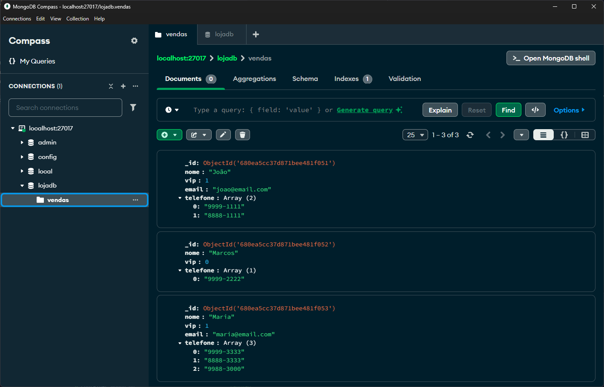
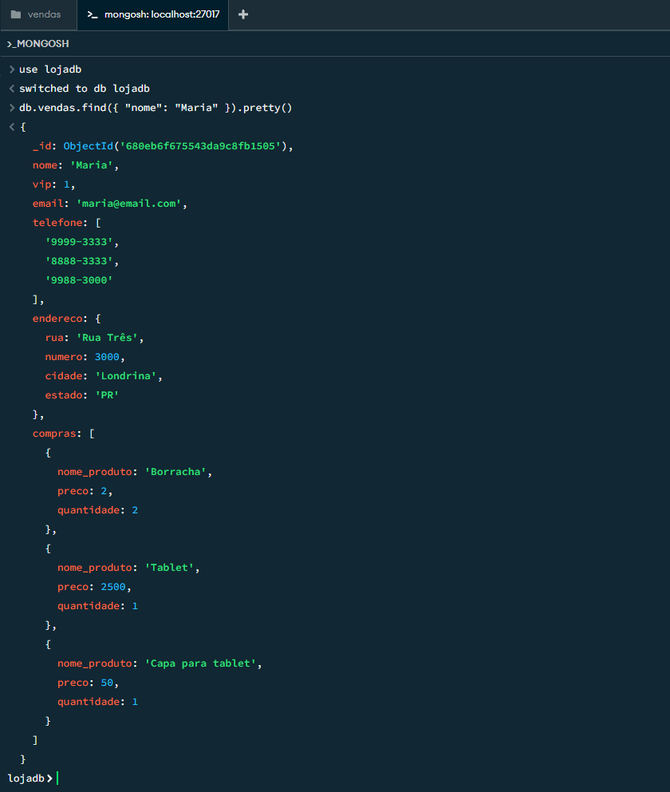
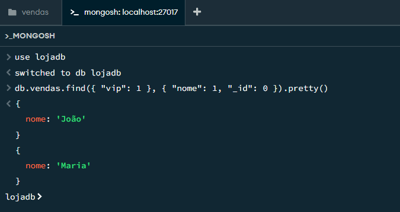
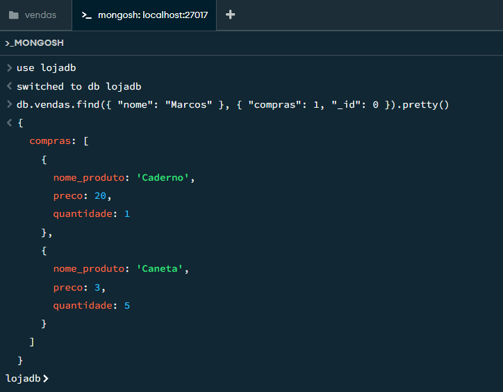
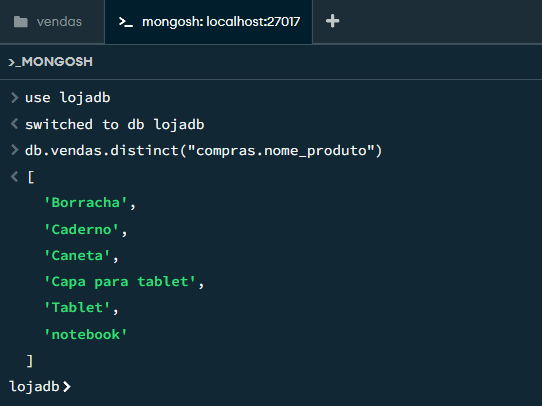
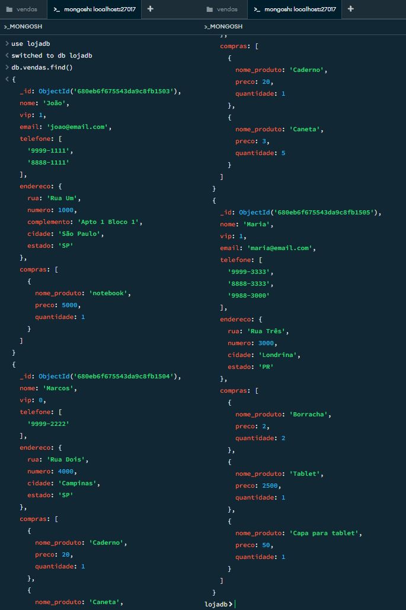
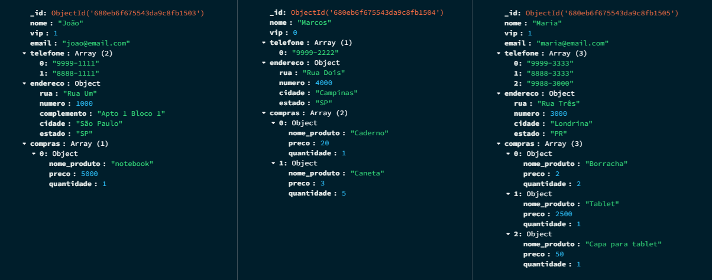

# Portfolio — Bancos de Dados Não Relacionais

Este relatório tem como objetivo apresentar as atividades realizadas como parte dos requisitos para a avaliação parcial do semestre, aplicando conceitos de **Bancos de Dados Não Relacionais**. O foco principal é a criação e manipulação de um banco de dados não relacional no **MongoDB Community Server**, utilizando o **MongoDB Compass** para inserir e atualizar documentos em uma collection.

## Informações Adicionais

> **Nome:** Raphael Henrique Vieira Coelho  
> **Matrícula:** 3481350205  
> **Curso:** Inteligência de Mercado e Análise de Dados  
> **Instituição:** Faculdade Anhanguera  
> **Período:** 5º Semestre / 2025  
> **E-mail:** <raphael.phael@gmail.com>

## Atividades Propostas

- Criar um banco de dados no **MongoDB Compass**, **inserir** e **atualizar** documentos em uma collection.
- Realizar pesquisas e consultas em um banco de dados não relacional (**MongoDB**).
- Elaborar um relatório com as atividades realizadas, incluindo prints das telas e explicações sobre os processos executados, incluindo: **Introdução**, **Metodologia**, **Resultados** e **Conclusão**.

## Checklist

- Acessar o **MongoDB Compass**
- Criar um banco de dados no **MongoDB**
- Criar uma collection em um banco de dados
- **Inserir** documentos na collection criada
- **Atualizar** a collection `vendas` no banco de dados `lojadb` de acordo com as informações das tabelas.
- Navegar até a collection `vendas` do banco de dados `lojadb`
- Realizar as 5 consultas especificadas.

## 1. Introdução

Este relatório detalha a prática realizada com o **MongoDB**, um banco de dados **NoSQL** orientado a documentos. O objetivo foi compreender os fundamentos de bancos não relacionais, utilizando **inserções**, **atualizações** e consultas sobre dados de clientes e suas compras.

Diferentemente dos bancos de dados relacionais, os bancos **NoSQL**, como o **MongoDB**, oferecem flexibilidade de estrutura, escalabilidade horizontal e melhor desempenho para dados semiestruturados. São amplamente utilizados em aplicações modernas, como e-commerce, redes sociais e sistemas de recomendação.

<div style="page-break-after: always;"></div>

## 2. Métodos

### 2.1 Configuração do Ambiente e Ferramentas

As seguintes ferramentas foram utilizadas:

- **MongoDB Community Server**: O banco de dados **NoSQL** orientado a documentos.
- **MongoDB Compass**: Interface gráfica para interagir com o banco de dados **MongoDB**.
- **VS Code**: Editor de texto para geração da documentação e arquivos auxiliares.

### 2.2 Aquisição e Preparação dos Dados (Procedimento/Atividade № 1)

A atividade consistiu em criar um banco de dados `lojadb` para simular o contexto de uma loja, registrando informações de clientes e suas vendas. Estou utilizando o **shell** para executar os comandos.

### Etapa 1: Criação do Banco e Collection e Inserção Inicial

1. Criação do banco de dados `lojadb` com a collection `vendas`.

    

    <div style="page-break-after: always;"></div>

2. Inserção dos dados básicos dos clientes na collection `vendas`, onde o campo `telefone` é um array.
  
    ```javascript
    // db-vendas-insertMany
    db.vendas.insertMany([
      {
        "nome": "João",
        "vip": 1,
        "email": "joao@email.com",
        "telefone": ["9999-1111", "8888-1111"]
      },
      {
        "nome": "Marcos",
        "vip": 0,
        "telefone": ["9999-2222"]
      },
      {
        "nome": "Maria",
        "vip": 1,
        "email": "maria@email.com",
        "telefone": ["9999-3333", "8888-3333", "9988-3000"]
      }
    ])
    ```

### Etapa 2: Atualização dos Documentos

1. Atualização com o campo `endereco` (objeto aninhado: `rua`, `numero`, `complemento`, `cidade`, `estado`).

    a. Atualização do endereço de João.

      ```javascript
      // db-vendas-update-joao-endereco
      db.vendas.updateOne(
        { "nome": "João" },
        {
          $set: {
            "endereco": {
              "rua": "Rua Um",
              "numero": 1000,
              "complemento": "Apto 1 Bloco 1",
              "cidade": "São Paulo",
              "estado": "SP"
            }
          }
        }
      )
      ```

    b. Atualização do endereço de Marcos.

      ```javascript
      // db-vendas-update-marcos-endereco
      db.vendas.updateOne(
        { "nome": "Marcos" },
        {
          $set: {
            "endereco": {
              "rua": "Rua Dois",
              "numero": 4000,
              "cidade": "Campinas",
              "estado": "SP"
            }
          }
        }
      )
      ```

    c. Atualização do endereço de Maria.

      ```javascript
      // db-vendas-update-maria-endereco
      db.vendas.updateOne(
        { "nome": "Maria" },
        {
          $set: {
            "endereco": {
              "rua": "Rua Três",
              "numero": 3000,
              "cidade": "Londrina",
              "estado": "PR"
            }
          }
        }
      )
      ```

2. Atualização com o campo `compras` (array de objetos: `nome_produto`, `preco`, `quantidade`).

    a. Atualização das compras de João.

      ```javascript
      // db-vendas-update-joao-compras
      db.vendas.updateOne(
        { "nome": "João" },
        {
          $set: {
            "compras": [
              { "nome_produto": "notebook", "preco": 5000.00, "quantidade": 1 }
            ]
          }
        }
      )
      ```

    b. Atualização das compras de Marcos.

      ```javascript
      // db-vendas-update-marcos-compras
      db.vendas.updateOne(
        { "nome": "Marcos" },
        {
          $set: {
            "compras": [
              { "nome_produto": "Caderno", "preco": 20.00, "quantidade": 1 },
              { "nome_produto": "Caneta", "preco": 3.00, "quantidade": 5 }
            ]
          }
        }
      )
      ```

    c. Atualização das compras de Maria.

      ```javascript
      // db-vendas-update-maria-compras
      db.vendas.updateOne(
        { "nome": "Maria" },
        {
          $set: {
            "compras": [
              { "nome_produto": "Borracha", "preco": 2.00, "quantidade": 2 },
              { "nome_produto": "Tablet", "preco": 2500.00, "quantidade": 1 },
              { "nome_produto": "Capa para tablet", "preco": 50.00, "quantidade": 1 }
            ]
          }
        }
      )
      ```

### 2.3 Processamento de Dados (Procedimento/Atividade № 2)

Esta etapa focou na execução das 5 queries sugeridas na atividade.

1. Consulta que localiza as informações da cliente “Maria”.

    ```javascript
    // db-vendas-find-maria
    db.vendas.find({ "nome": "Maria" }).pretty()
    ```

    

    <div style="page-break-after: always;"></div>

2. Consulta que retorna o campo `nome` dos clientes VIPs.

    ```javascript
    // db-vendas-find-vips
    db.vendas.find({ "vip": 1 }, { "nome": 1, "_id": 0 }).pretty()
    ```

    

3. Consulta que exibe as `compras` efetuadas por “Marcos”.

    ```javascript
    // db-vendas-find-marcos-compras
    db.vendas.find({ "nome": "Marcos" }, { "compras": 1, "_id": 0 }).pretty()
    ```

    

    <div style="page-break-after: always;"></div>

4. Consulta que retorna os **nomes dos produtos** distintos comprados por todos os clientes.
  
    ```javascript
    // db-vendas-distinct-produtos
    db.vendas.distinct("compras.nome_produto")
    ```

    

    <div style="page-break-after: always;"></div>

5. Consulta que retorna todos os documentos da collection.

    ```javascript
    // db-vendas-find-all
    db.vendas.find().pretty()
    ```

    

<div style="page-break-after: always;"></div>

## 3. Resultados

As consultas realizadas na base `lojadb` permitiram observar, na prática, como o **MongoDB** lida com diferentes estruturas de dados. Os principais pontos identificados foram:

- A consulta geral mostrou que os dados foram **inseridos** e **atualizados** corretamente.
- A busca por nome facilitou encontrar informações específicas, como o registro da cliente **Maria**.
- A projeção de campos permitiu visualizar apenas os dados necessários, como os nomes dos clientes **VIPs**.
- Consultas em arrays e objetos aninhados, como as `compras` de cada cliente, mostraram a flexibilidade do modelo de documentos.
- A consulta de produtos distintos ajudou a identificar todos os itens comprados, sem repetições.

Esses resultados mostram que o **MongoDB** pode ser útil em situações que exigem flexibilidade e consultas variadas, contribuindo para a análise dos dados de forma simples e eficiente.

  

## 4. Conclusão

A atividade prática permitiu conhecer, de forma simples, o funcionamento do **MongoDB** para criar, atualizar e consultar dados em um banco não relacional. Foi possível perceber a flexibilidade do modelo de documentos e a facilidade para realizar consultas variadas. A experiência contribuiu para entender conceitos básicos de bancos de dados **NoSQL** e como aplicá-los em situações do dia a dia.

Como complemento, os arquivos utilizados durante a atividade — incluindo scripts e consultas — estão disponíveis no repositório do projeto no [GitHub](https://github.com/pagueru/portfolios-business-intelligence-data-analysis/tree/master/portfolio-nosql-database).

## 5. Referências Bibliográficas

MongoDB. (2024). *MongoDB Documentation*. Disponível em: [https://www.mongodb.com/pt-br/docs/mongodb-shell/crud/](https://www.mongodb.com/pt-br/docs/mongodb-shell/crud/)  
Markdown Community. (2024). *The Markdown Guide*. Disponível em: [https://www.markdownguide.org/basic-syntax/](https://www.markdownguide.org/basic-syntax/)  
MongoDB. (2024). *O que é um banco de dados de documentos?*. Disponível em: [https://www.mongodb.com/pt-br/resources/basics/databases/document-databases](https://www.mongodb.com/pt-br/resources/basics/databases/document-databases)
