# Relatório de Aula Prática — Bancos de Dados Não Relacionais

Este relatório tem como objetivo apresentar as atividades realizadas como parte dos requisitos para a avaliação parcial do semestre, aplicando conceitos de **Bancos de Dados Não Relacionais**. O foco principal é a criação e manipulação de um banco de dados não relacional no **MongoDB Community Server**, utilizando o **MongoDB Compass** para inserir e atualizar documentos em uma collection.

## Informações Adicionais

| **Autor**        | Raphael Henrique Vieira Coelho |
|------------------|--------------------------------|
| **RA**           | 3481350205                     |
| **Instituição**  | Faculdade Anhanguera           |
| **Curso**        | Inteligência de Mercado e Análise de Dados |
| **Semestre**     | 4º Semestre / 2025             |

## Atividades Propostas

1. Criar um banco de dados no MongoDB Compass, inserir e atualizar documentos em uma collection.
2. Realizar pesquisas e consultas em um banco de dados não relacional (MongoDB).
3. Elaborar um relatório com as atividades realizadas, incluindo prints das telas e explicações sobre os processos executados, incluindo: Introdução, Metodologia, Resultados e Conclusão.

### Checklist

- Acessar o **MongoDB Compass**
- Criar um banco de dados no **MongoDB**
- Criar uma collection em um banco de dados
- Inserir documentos na collection criada
- Atualizar a collection **vendas** no banco de dados **lojadb** de acordo com as informações das tabelas.
- Navegar até a collection **vendas** do banco de dados **lojadb**
- Realizar as 5 consultas especificadas.

## 1. Introdução

Este relatório detalha a prática realizada com o **MongoDB**, um banco de dados **NoSQL** orientado a documentos. Os resultados da aula prática foram:

- Desenvolver bancos de dados não relacionais orientados a documentos utilizando o **MongoDB**
- Criação de collections e inserção/atualização de documentos
- Realização de consultas à base de dados

## 2. Métodos

### 2.1 Configuração do Ambiente e Ferramentas

As seguintes ferramentas foram utilizadas:

- **MongoDB Community Server**: O banco de dados NoSQL orientado a documentos.
- **MongoDB Compass**: Interface gráfica para interagir com o banco de dados **MongoDB**.
- **VS Code**: Editor de texto para documentação.

### 2.2 Aquisição e Preparação dos Dados (Procedimento/Atividade № 1)

A atividade consistiu em criar um banco de dados **lojadb** para simular o contexto de uma loja, registrando informações de clientes e suas vendas. Estou utilizando o **Shell** para executar os comandos.

#### Etapa 1: Criação do Banco e Collection e Inserção Inicial

1. Criação do banco de dados **lojadb** com a collection **vendas**.
2. Inserção dos dados básicos dos clientes na collection **vendas**, onde o campo **telefone** é um array.
  
      

      ```js
      // db-vendas-insertMany
      db.vendas.insertMany([
        {
          "nome": "João",
          "vip": 1,
          "email": "joao@email.com",
          "telefone": ["9999-1111", "8888-1111"]
        },
        {
          "nome": "Marcos",
          "vip": 0,
          "telefone": ["9999-2222"]
        },
        {
          "nome": "Maria",
          "vip": 1,
          "email": "maria@email.com",
          "telefone": ["9999-3333", "8888-3333", "9988-3000"]
        }
      ])
      ```

#### Etapa 2: Atualização dos Documentos

1. Atualização com o campo **endereço** (objeto aninhado: `rua`, `numero`, `complemento`, `cidade`, `estado`).

      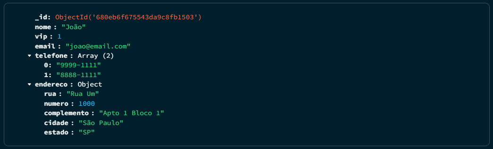

      ```js
      // db-vendas-update-joao-endereco
      db.vendas.updateOne(
        { "nome": "João" },
        {
          $set: {
            "endereco": {
              "rua": "Rua Um",
              "numero": 1000,
              "complemento": "Apto 1 Bloco 1",
              "cidade": "São Paulo",
              "estado": "SP"
            }
          }
        }
      )
      ```

      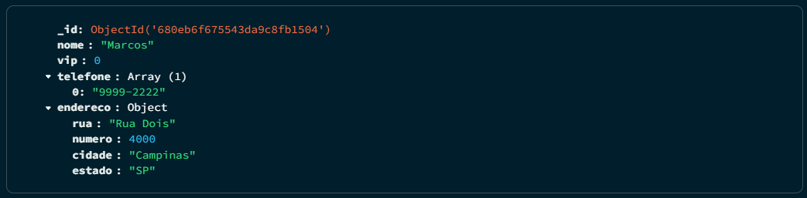

      ```js
      // db-vendas-update-marcos-endereco
      db.vendas.updateOne(
        { "nome": "Marcos" },
        {
          $set: {
            "endereco": {
              "rua": "Rua Dois",
              "numero": 4000,
              "cidade": "Campinas",
              "estado": "SP"
            }
          }
        }
      )
      ```

      

      ```js
      // db-vendas-update-maria-endereco
      db.vendas.updateOne(
        { "nome": "Maria" },
        {
          $set: {
            "endereco": {
              "rua": "Rua Três",
              "numero": 3000,
              "cidade": "Londrina",
              "estado": "PR"
            }
          }
        }
      )
      ```

      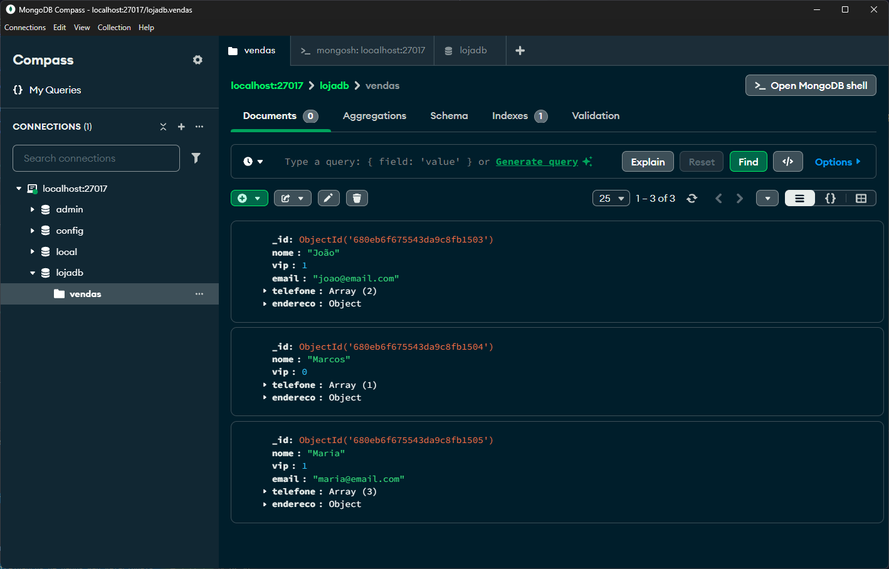

2. Atualização com o campo **compras** (array de objetos: `nome_produto`, `preco`, `quantidade`).

    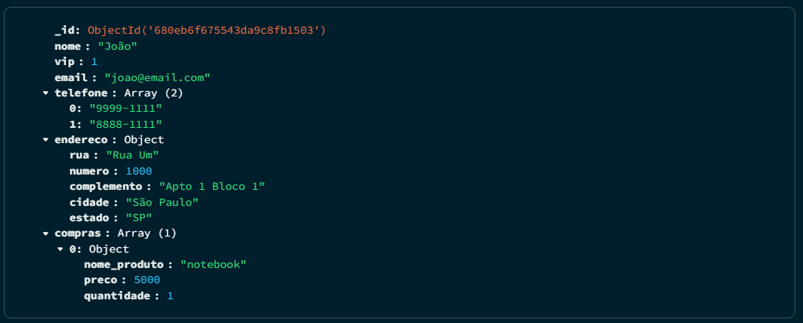

    ```js
    // db-vendas-update-joao-compras
    db.vendas.updateOne(
      { "nome": "João" },
      {
        $set: {
          "compras": [
            { "nome_produto": "notebook", "preco": 5000.00, "quantidade": 1 }
          ]
        }
      }
    )
    ```

    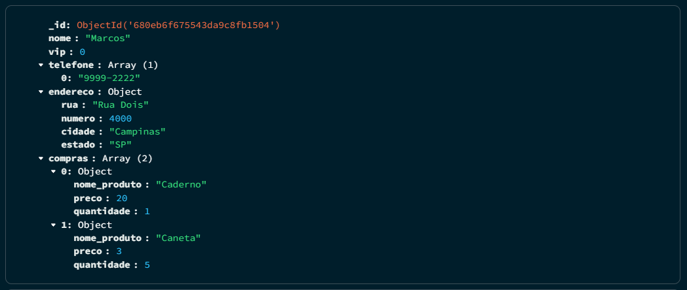

    ```js
    // db-vendas-update-marcos-compras
    db.vendas.updateOne(
      { "nome": "Marcos" },
      {
        $set: {
          "compras": [
            { "nome_produto": "Caderno", "preco": 20.00, "quantidade": 1 },
            { "nome_produto": "Caneta", "preco": 3.00, "quantidade": 5 }
          ]
        }
      }
    )
    ```

    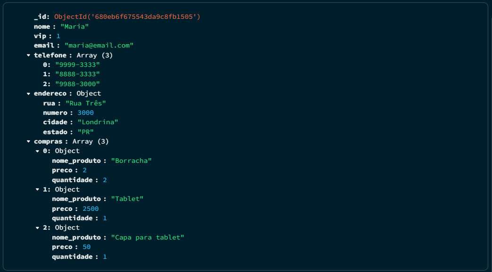

    ```js
    // db-vendas-update-maria-compras
    db.vendas.updateOne(
      { "nome": "Maria" },
      {
        $set: {
          "compras": [
            { "nome_produto": "Borracha", "preco": 2.00, "quantidade": 2 },
            { "nome_produto": "Tablet", "preco": 2500.00, "quantidade": 1 },
            { "nome_produto": "Capa para tablet", "preco": 50.00, "quantidade": 1 }
          ]
        }
      }
    )
    ```

    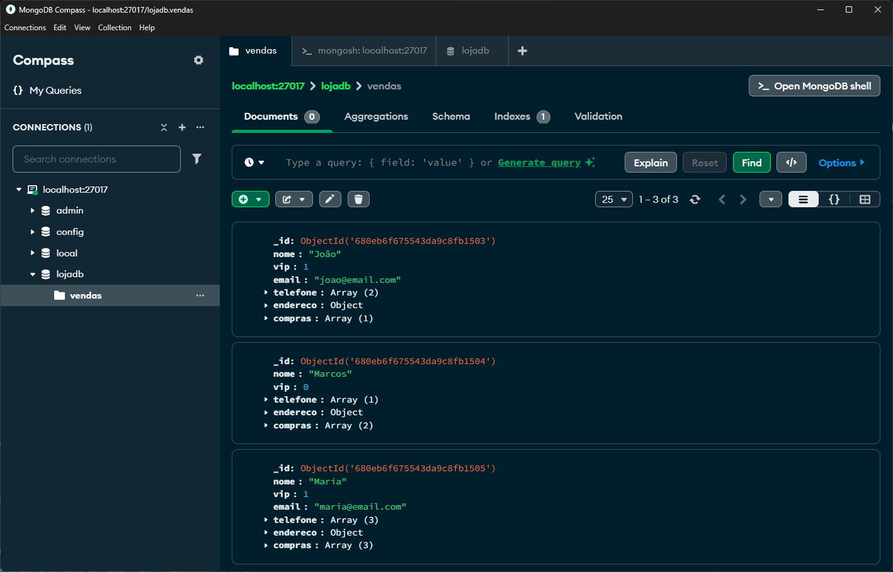

### 2.3 Processamento de Dados (Procedimento/Atividade № 2)

Esta etapa focou na realização de consultas (**queries**) na collection **vendas** do banco **lojadb**.

Dica: Utilizar `.pretty()` ao final dos comandos **find** na **Shell** do **MongoDB** para melhor formatação do resultado.

1. Consulta que retorna todos os documentos da collection.

    ```js
    // db-vendas-find-all
    db.vendas.find().pretty()
    ```

    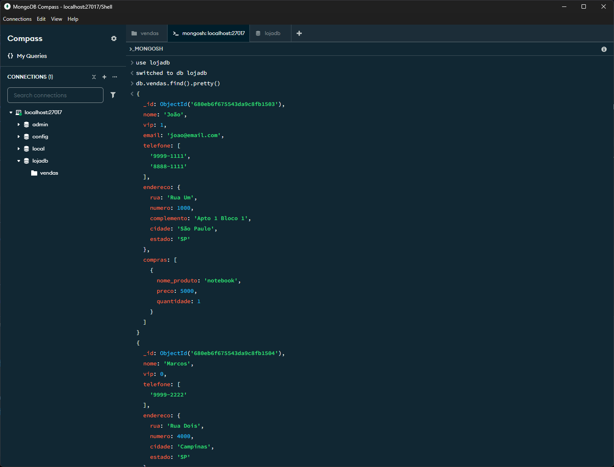

2. Consulta que localiza as informações da cliente “Maria”.

    ```js
    // db-vendas-find-maria
    db.vendas.find({ "nome": "Maria" }).pretty()
    ```

    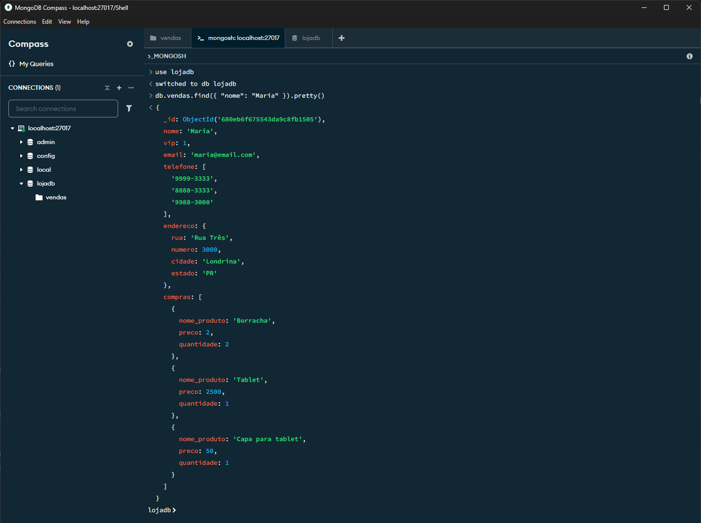

3. Consulta que retorna o campo `nome` dos clientes **VIPs**.

    ```js
    // db-vendas-find-vips
    db.vendas.find({ "vip": 1 }, { "nome": 1, "_id": 0 }).pretty()
    ```

    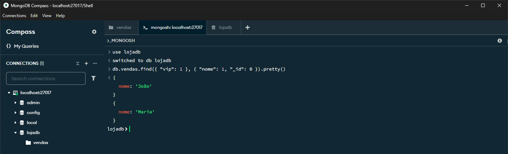

4. Consulta que exibe as **compras** efetuadas por “Marcos”.

    ```js
    // db-vendas-find-marcos-compras
    db.vendas.find({ "nome": "Marcos" }, { "compras": 1, "_id": 0 }).pretty()
    ```

    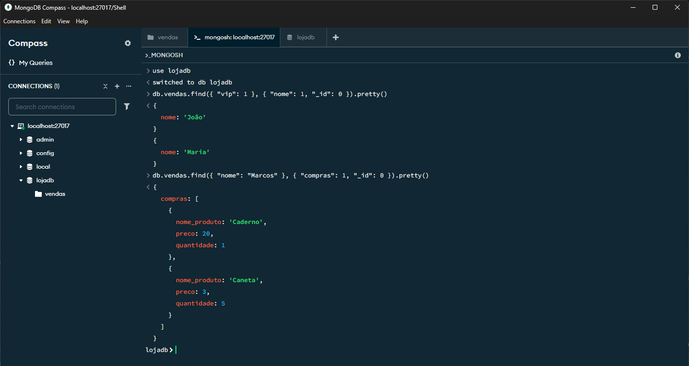

5. Consulta que retorna os **nomes dos produtos** distintos comprados por todos os clientes.

    ```js
    // db-vendas-distinct-produtos
    db.vendas.distinct("compras.nome_produto")
    ```

    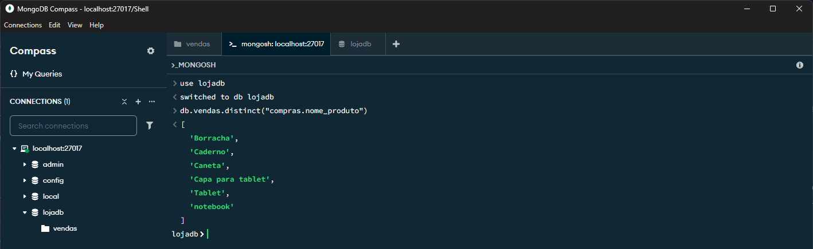

## 3. Resultados

As consultas realizadas permitiram extrair informações específicas da base de dados **lojadb**.

- A consulta geral retornou todos os documentos completos.
- A consulta por nome filtrou eficientemente o documento da cliente **Maria**.
- A projeção permitiu selecionar apenas os campos desejados (nomes dos clientes **VIPs**).
- Foi possível consultar dados dentro de estruturas aninhadas como a array de **compras**.
- Consultas mais avançadas (como a de nomes de **produtos distintos**) demonstraram a capacidade de **agregação** do **MongoDB**.

## 4. Conclusão

A aula prática proporcionou experiência na utilização do **MongoDB** para criar, popular, atualizar e consultar um banco de dados não relacional orientado a documentos. Foram aplicados conceitos importantes como a flexibilidade de esquema, o uso de arrays e objetos aninhados, e a execução de diferentes tipos de consultas. Ao final da prática, espera-se que o aluno tenha desenvolvido a capacidade de trabalhar com bancos de dados **MongoDB** em cenários básicos.

## 5. Referências Bibliográficas

- MongoDB. (2024). *MongoDB Documentation*. Disponível em: [https://www.mongodb.com/pt-br/docs/](<https://www.mongodb.com/pt-br/docs/>)
- Markdown Community. (2024). The Markdown Guide. Disponível em: [https://www.markdownguide.org/](https://www.markdownguide.org/)
