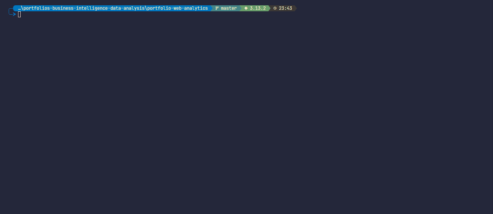

# Portfolio — Web Analytics

Automatização do processo de coleta e transformação de dados de mangás, integrando scraping do Goodreads, parsing HTML parametrizado via YAML e datasets do Kaggle, com foco em web analytics e arquitetura limpa.

<p align="center">
  
</p>

[](https://www.python.org/)
[](https://github.com/astral-sh/uv)
[](https://github.com/astral-sh/ruff)
[](https://www.anhanguera.com/)
[](https://www.colaboraread.com.br/login/auth)

---

## Sobre o Projeto

Este projeto tem como objetivo aprofundar conhecimentos em Python, web scraping e arquitetura limpa, por meio do desenvolvimento de um pipeline para coleta de dados de livros. A aplicação integra scraping do Goodreads, parsing HTML parametrizado via YAML e uso de datasets do Kaggle, permitindo a extração, normalização e consolidação de informações. O pipeline foi inicialmente testado com o mangá [Oyasumi Punpun](https://www.goodreads.com/book/show/25986929-goodnight-punpun-omnibus-vol-1), mas pode ser adaptado para outras obras com ajustes no `settings.yaml`.

Esta solução evolui conhecimentos de projetos anteriores, como o [py-selenium-scraper](https://github.com/pagueru/py-selenium-scraper), e adota alguns princípios de Clean Architecture para promover organização, manutenibilidade e aprendizado contínuo.

> [!IMPORTANT]  
> **Atenção ética:** Este projeto é destinado a fins acadêmicos e demonstração técnica. Ao utilizar técnicas de scraping, é fundamental respeitar os termos de uso das plataformas, a legislação vigente (LGPD, GDPR etc.) e os princípios éticos de privacidade e consentimento.

### Principais aprendizados

- **BeautifulSoup**: Extração direta de dados de HTML com seletores simples e baixo custo computacional.
- **HTTPX**: Cliente HTTP assíncrono com suporte a timeout e retries.
- **Kaggle**: Acesso automatizado a datasets via API com autenticação e download direto.
- **Clean Architecture**: Separação de responsabilidades por camadas, promovendo organização e manutenção do código.
- **Boas Práticas**: Adoção de tipagem forte, validações, linting com Ruff e leitura facilitada do código.

**Nota sobre escolha de biblioteca HTTP**
A biblioteca `httpx` foi escolhida em vez de `requests` como forma de aprendizado e, após alguns testes, apresentou melhor desempenho em meus cenários. Embora seu foco principal seja em operações assíncronas, `httpx` também oferece suporte completo a chamadas síncronas.

Veja mais em:

- [Requests vs. HTTPX - A Detailed Comparison](https://scrapingant.com/blog/requests-vs-httpx)
- [python-http-libraries-benchmark](https://github.com/perodriguezl/python-http-libraries-benchmark)

## Requisitos

- [Python](https://www.python.org/downloads/)
- [Pyenv](https://pypi.org/project/pyenv/)
- [uv](https://docs.astral.sh/uv/getting-started/installation/)

Para usar este projeto, recomenda-se o `Pyenv` para gerenciar versões do Python e o `uv` para as dependências do `pyproject.toml`. Ambos são opcionais, pois você pode usar a versão do Python do sistema e instalar dependências via `pip` com o `requirements.txt`.

## Instalação

Instalação recomendada (usando uv):

```bash
uv sync --all-extras
```

Alternativamente, você pode instalar as dependências via `requirements.txt`:

```bash
pip install -r requirements.txt
```

## Fluxo do Pipeline

O pipeline é dividido em execuções das classes, cada uma responsável por uma parte específica do processo de coleta e transformação de dados. É possível executar cada parte individualmente, como visto na pasta `examples`.

```bash
uv run ./examples/goodreads_parser_example.py
uv run ./examples/goodreads_scraper_example.py
uv run ./examples/kaggle_dataset_provider_example.py
```

1. **Leitura das configurações** (`SettingsManager`)
   - Carrega e valida os arquivos de configuração YAML (`settings.yaml` e `parser.yaml`).
   - Garante que todos os parâmetros necessários estejam presentes para o funcionamento do pipeline.

2. **Scraping do Goodreads** (`GoodreadsScraper`)
   - Realiza a busca do livro/mangá no site Goodreads, utilizando os parâmetros definidos em `settings.yaml`.
   - Faz o download do HTML da página do livro e salva em disco, utilizando cache para evitar downloads desnecessários.

    <details>
      <summary><code>Exemplo de execução isolada </code></summary>

    ```python
    # Adicionando a classe de configuração do projeto
    config_repository = SettingsManager()

    # Instanciando a classe
    repository = GoodreadsScraper(config_repository.goodreads_settings)

    # Chamando o método principal
    html_path = repository.execute_download()
    ```

    </details>

3. **Parsing do HTML** (`GoodreadsParser`)
   - Utiliza o HTML baixado e o arquivo `parser.yaml` para extrair informações estruturadas (título, autor, páginas, avaliações, etc.).
   - Normaliza e formata os dados extraídos para uso posterior.

    <details>
      <summary><code>Exemplo de execução isolada </code></summary>

    ```python
    # Inicializa o ParserRepository
    parser = GoodreadsParser()

    # Extrai dados com base no arquivo YAML
    extracted_data = parser.extract_from_yaml(PARSER_FILE)

    # Formata os dados extraídos para remover espaços e quebras de linha
    extracted_data = parser.format_extracted_data(extracted_data)

    # Exibe os dados extraídos e formatados
    print(json.dumps(extracted_data, indent=4, ensure_ascii=False))
    ```

    </details>

4. **Download e filtragem do dataset Kaggle** (`KaggleDatasetProvider`)
   - Baixa o dataset de mangás do Kaggle, conforme especificado em `settings.yaml`.
   - Filtra o dataset para obter apenas os dados do mangá de interesse.
   - Converte os dados filtrados para JSON.

    <details>
      <summary><code>Exemplo de execução isolada </code></summary>

    ```python
    # Instancia a classe de configuração do projeto
    config_repository = SettingsManager()
    
    # Instancia a classe KaggleRepository
    kaggle_repository = KaggleDatasetProvider(config_repository.kaggle_settings)
    
    # Faz o download do dataset do Kaggle
    kaggle_repository.download_dataset()
    
    # Carrega o arquivo CSV em um DataFrame
    manga_dataset = kaggle_repository.load_dataframe("manga.csv")
    
    # Filtra o DataFrame pelo nome do mangá "PunPun"
    manga_dataset = kaggle_repository.filter_by_manga_name(manga_dataset)
    
    # Converte o DataFrame filtrado para JSON
    manga_json = kaggle_repository.dataframe_to_json(manga_dataset)
    
    # Exibe o JSON formatado no console
    print(json.dumps(manga_json, indent=2, ensure_ascii=False))
    ```

    </details>

5. **Normalização e união dos dados** (`WebAnalyticsPipeline`)
   - Realiza a normalização final dos dados extraídos do Goodreads e Kaggle.
   - Une os dados em um único dicionário estruturado.

6. **Exportação do JSON final**
   - Salva o resultado consolidado em `data/output/pipeline_results.json`.

## Exemplo de Arquivo de Configuração

```yaml
goodreads:
  book_url_base: "https://www.goodreads.com/book/show/"
  search_url_base: "https://www.goodreads.com/search?query="
  search_book_title: "PunPun"
  cache_seconds: 600
  book_fallback: "25986929-goodnight-punpun-omnibus-vol-1"

kaggle:
  manga_name: "PunPun"
  dataset_name: "duongtruongbinh/manga-and-anime-dataset"
  dataset_files:
    - "manga.csv"
  force_download: false
```

## Execução do Pipeline

```bash
uv run main.py
```

O script `main.py` executa a classe `WebAnalyticsPipeline`, que orquestra todo o processo de scraping, parsing e exportação dos dados. O resultado final é salvo em `data/output/pipeline_results.json`.

Abaixo o resultado esperado após a execução do pipeline:

```json
{
  "goodreads": {
    "title": "Goodnight Punpun Omnibus, Vol. 1",
    "author": "Inio Asano",
    "pages": 426,
    "publication": "First published January 1, 2006",
    "ratings_count": 20394,
    "reviews": 1984,
    "rating": 4.27,
    "author_books": 106,
    "author_followers": 2,
    "author_bio": "Inio Asano ( 浅野いにお , Asano Inio ) is a Japanese cartoonist. ...",
    "description": "Meet Punpun Punyama. He’s an average kid in an average town..."
  },
  "kaggle": {
    "title": "Oyasumi Punpun (Goodnight Punpun)",
    "score": 9.01,
    "vote": 176269,
    "ranked": 10,
    "popularity": 9,
    "members": 430160,
    "favorite": 51039,
    "volumes": 13,
    "chapters": 147,
    "status": "Finished",
    "published": "Mar  15, 2007 to Nov  2, 2013",
    "genres": ["Drama", "Slice of Life"],
    "themes": [],
    "demographics": ["Seinen"],
    "serialization": "Big Comic Spirits",
    "author": "Asano, Inio (Story & Art)"
  }
}
```

## Melhorias e Tarefas Futuras

- [ ] Melhorar o tratamento de erros e mensagens para o usuário
- [ ] Separar uma classe dedicada para o tratamento e normalização dos dados
- [ ] Validar múltiplos mangás e alimentar um banco SQLite
- [ ] Simplificar o parse do HTML (o uso do YAML é interessante, mas a manutenção do arquivo é trabalhosa)
- [ ] Corrigir redundância de variáveis, utilizando as constantes globais
- [ ] Remover `lint.ignore` temporários do `pyproject.toml` e corrigir os erros apontados pelo linter
- [ ] Atualizar os comandos do Makefile para facilitar a automação
- [ ] Adicionar testes unitários

## Contato

GitHub: [pagueru](https://github.com/pagueru/)

LinkedIn: [Raphael Coelho](https://www.linkedin.com/in/raphaelhvcoelho/)

E-mail: [raphael.phael@gmail.com](mailto:raphael.phael@gmail.com)
